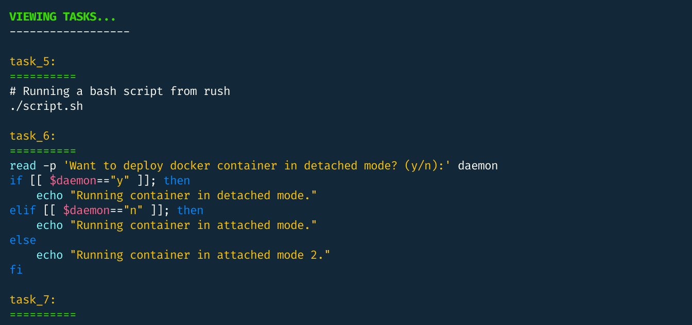

<div align="center">

# Rush 🏃
**A Minimalistic Bash Task Runner**


**Run all your task automation **Bash commands** from a single `rushfile.yml` file.**
</div>


* You can you ignore task execution by adding `//` before taskname in the `rushfile.yml`


## Features
* Supports all bash commands
* By default, runs commands in interactive mode
* Highlights the commands as they get executed
* Option to catch or ignore command errors
* Option to show or supress command outputs
* Command chaining is supported (See the example `rushfile.yml` where `task_2` is chained to `task_1`)
* Individual tasks can be ignored

## Installation

```
$ pip3 install rush-cli
```

## Workflow

### Rushfile
Here is an example `rushfile.yml`. It needs to reside in the root directory:

``` yml
task_1: |
    echo "task1 is running"
    ls

task_2: |
    # Task chaining [task_1 is a dependency of task_2]
    task_1
    echo "task2 is running"

task_3: |
    l -a
    echo "task_3 is running"

//task_4: |
    # Ignoring a task [task_4 will be ignored while execution]
    ls | grep "ce"
    ls > he.txt1

task_5: |
    # Running a bash script from rush
    ./script.sh

```

### Available Options
To see all the available options, run:
```
$ rush --help
```
This should show:


### Running Tasks

* **Run all the tasks**
    ```
    $ rush
    ```

* **Run specific tasks**
    ```
    $ rush task_1 task_4
    ```
* **Run tasks non interactively** (supress the outputs)
    ```
    $ rush --hide-outputs
    ```
* **Run tasks without printing individual commands**
    ```
    $ rush task_1 task_2 --hide-commands
    ```

* **Run tasks ignoring errors**
    ```
    $ rush --ignore-errors
    ```

* **View tasks without running**
    ```
    $ rush --view-tasks
    ```

* **View filtered tasks without running**
    ```
    $rush task_2 task_1 --view-tasks
    ```
    


## Quirks

* Rush runs all the commands using `/usr/bin/bash`. So shell specific syntax with other shebangs might throw error. In these cases, I encourage you to create dedicated shell scripts with proper shebang (`#!/usr/bin/env bash`) and add those as tasks in the rushfile.
